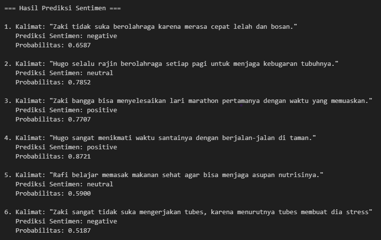
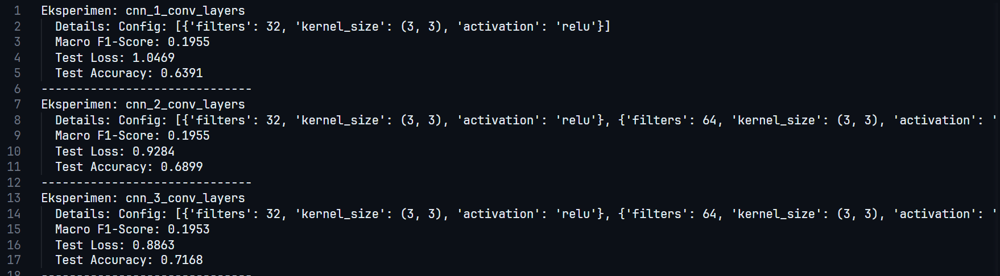

# Indonesian Sentiment Prediction

This repository contains a machine learning project focused on sentiment analysis for Indonesian text. The project implements and compares different neural network architectures (LSTM, RNN) for classifying sentiment in Indonesian text.




# Image Classification
This repository contains a machine learning project focused on image classification using Convolutional Neural Networks (CNNs) with the CIFAR-10 dataset. The project's main focus is on implementing Forward Propagation for CNNs and comparing multiple hyperparameters to understand their effects on model performance.



## Overview


This project analyzes sentiment in Indonesian text, classifying them into three categories:
- Positive
- Neutral
- Negative

The project utilizes various deep learning architectures to compare their performance on the sentiment analysis task.

## Features

- Data preprocessing for Indonesian text
- Implementation of multiple neural network architectures:
  - LSTM (Long Short-Term Memory)
  - RNN (Recurrent Neural Network)
  - CNN (Convolutional Neural Network)
- Model training, evaluation, and inference
- Custom neural network implementation for analysis
- Visualization of model performance

## Dataset

The project uses the [NusaX sentiment dataset for Indonesian language](https://github.com/IndoNLP/nusax/tree/main/datasets/sentiment/indonesian), which includes labeled text data for training, validation, and testing. The dataset is organized into the following categories:
- Positive sentiment
- Neutral sentiment
- Negative sentiment

For the image classification task, this project also uses the [CIFAR-10 dataset](https://www.cs.toronto.edu/~kriz/cifar.html).
- The dataset contains 60,000 32x32 color images in 10 classes (6,000 images per class).
- In this project, the data is utilized as follows:
    - Training set: 40,000 images
    - Validation set: 10,000 images (derived from the original 50,000 training images)
    - Test set: 10,000 images

## Installation

1. Clone this repository
2. Set up a virtual environment and activate it:

```bash
python -m venv venv
./venv/Scripts/Activate  # For Windows
# OR
source venv/bin/activate  # For Linux/Mac
```

3. Install the required dependencies:

```bash
pip install -r requirements.txt
```


## Dependencies

- TensorFlow >= 2.4.0
- NumPy >= 1.19.5
- pandas >= 1.1.5
- matplotlib >= 3.3.4
- scikit-learn >= 0.24.1
- h5py >= 2.10.0


## Tasks

<table border="1">
    <tr>
        <th>No</th>
        <th>Name</th>
        <th>NIM</th>
        <th>Tasks</th>
    </tr>
    <tr>
        <td>1</td>
        <td>Hugo Sabam Augusto</td>
        <td>13522129</td>
        <td>LSTM Implementation</td>
    </tr>
    <tr>
        <td>2</td>
        <td>Muhammad Zaki</td>
        <td>13522136</td>
        <td>CNN Implementation</td>
    </tr>
    <tr>
        <td>3</td>
        <td>Ahmad Rafi Maliki</td>
        <td>13522137</td>
        <td>RNN Implementation</td>
    </tr>
</table>

